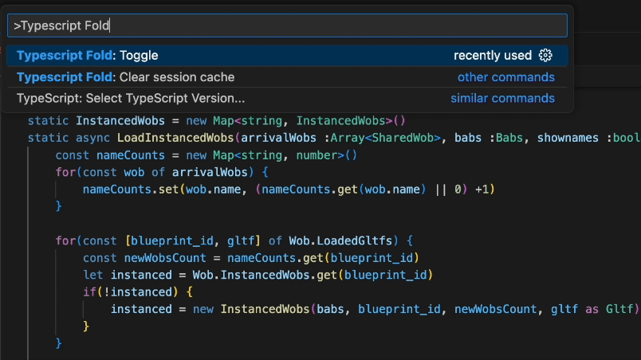

## Typescript Fold - VSCode Extension

A vscode extension to hide Typescript nodes so that code looks more like regular Javascript.  This reduces the amount of text to mentally process when reading code.  It can help increase focus on code logic.



A big thanks to the https://github.com/moalamri/vscode-inline-fold project, of which this is a narrowed fork.  The main change made here is to use the Typescript AST instead of regex to determine fold ranges.  

Threads requesting this ability:

- https://github.com/Microsoft/vscode/issues/36823
- https://stackoverflow.com/questions/73391541/vscode-hide-typescript-interfaces-types-feature

## Settings
There are two ways to configure the extension, both can be done either by using VS Code Settings UI, or by editing user/workspace json settings file. We will cover both ways `Global Settings` and `Language-specific Settings`.

### Global Settings
You can configure the extension from the settings UI under `User` or `Workspace` tabs (or by editing the json settings file).
```jsonc
{
  "typescriptFold.togglePerFile": false,
  "typescriptFold.unfoldedOpacity": 0.6,
  "typescriptFold.maskChar": "⋮",
  "typescriptFold.maskColor": "#000",
  "typescriptFold.supportedLanguages": ["javascriptreact", "typescriptreact"],
  "typescriptFold.unfoldOnLineSelect": true,
  "typescriptFold.autoFold": false
}
```
This will be the default settings for all languages in `typescriptFold.supportedLanguages`. 

## Keyboard Shortcuts
All the extension's commands are available under `Typescript Fold` command group. No default keyboard shortcuts are provided, but you can add your own shortcuts for the commands.

- On Macos, Cmd+Shift+P then type 'Typescript Fold'

## Available Settings
- `typescriptFold.togglePerFile` toggle the folding state per file or workspace (default: false)
- `typescriptFold.unfoldedOpacity` opacity of the unfolded code when it's clicked or is selected
- `typescriptFold.maskChar` text/character to mask the code when it is folded
- `typescriptFold.maskColor` color of the mask character(s)
- `typescriptFold.after` an optional text/character that will be appended to the end of folded code
- `typescriptFold.supportedLanguages` a list of targeted language Ids
- `typescriptFold.unfoldOnLineSelect` unfold the line when any part of the line is selected
- `typescriptFold.autoFold` the default state of Typescript Folding when opening a file
- `typescriptFold.useGlobal` force to use the global settings for all languages


## Running the extension
You can install the extension <a href="https://marketplace.visualstudio.com/items?itemName=AphLute.typescript-fold"> in the marketplace here</a>. If you encounter any issues or would like to contribute, <a href="https://github.com/AphLute/vscode-typescript-fold">visit the GitHub page</a>.

### Notes
* Use settings UI to configure the extension.
* If the extension doesn't work, then check for your language id, you can add it from the settings under `typescriptFold.supportedLanguages` using the specific language Id.
* You can set a keyboard shortcut to toggle the folding on and off. Search for "Typescript Fold" in the commands panel, then click the gear icon and set the desired keybinding.

Current default language Ids (see [here](https://code.visualstudio.com/docs/languages/identifiers#_known-language-identifiers) for more):
- `typescript`
- `typescriptreact`

Ids that were in the fork origination project:
- `astro`
- `vue`
- `html`
- `svelte`
- `vue-html`
- `php`
- `blade`
- `erb`
- `twig`
- `nunjucks`
- `django-html`
- `jinja-html`
- `javascript`
- `javascriptreact`

### Known Issues
If you encounter any problems, you can open an issue at the extension's <a href="https://github.com/AphLute/vscode-typescript-fold">GitHub repository</a>

### Contributors
This project is based on `moalamri/vscode-inline-fold`, see their [/graphs/contributors](https://github.com/moalamri/vscode-inline-fold/graphs/contributors).
